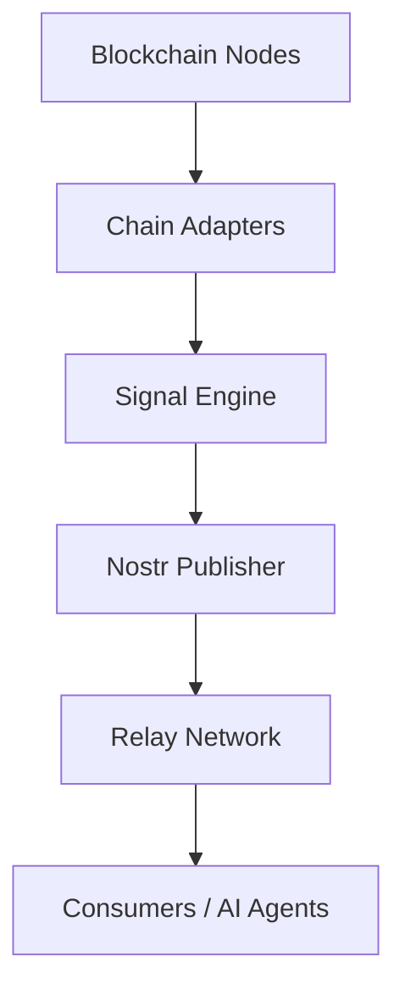

# Nostralytics — White Paper

January 2026

## 1. Executive Summary

Nostralytics is a decentralized, multi-chain analytics and signal infrastructure that transforms live blockchain activity into structured, cryptographically signed events on the Nostr protocol. 

It provides real-time, filterable, machine-readable feeds for developers, dashboards, bots, and AI agents without relying on centralized APIs, proprietary rate limits, or vendor lock-in.

**Vision**: To establish a uniform, social-native data layer for the multi-chain ecosystem, where every blockchain becomes a real-time, indexed discovery feed.

## 2. Problem Statement

Today’s blockchain data landscape suffers from several critical bottlenecks:

- **Fragmentation**: Each network employs disparate APIs, RPC semantics, and indexing services.
- **Centralization**: Most real-time data providers are centralized entities, creating single points of failure and subject to arbitrary throttling or paywalls.
- **Limited Composability**: Signals generated on-chain are rarely shared or standardized in a way that allows cross-application discovery.
- **High Barrier to Entry**: Building cross-chain monitoring Requires specialized infrastructure and significant engineering overhead.

There is currently no decentralized, real-time signal bus that developers and agents can subscribe to flexibly across heterogeneous environments.

## 3. The Nostr Solution

The Nostr protocol (Notes and Other Stuff Transmitted by Relays) is a decentralized, relay-based event distribution network defined by signed events, a peer-to-peer relay architecture, and flexible tagging/filtering.

Nostr is uniquely suited for blockchain signal distribution due to:
- **Cryptographic Integrity**: Every signal is signed by an Ed25519 identity.
- **Resilient Distribution**: Relays provide a decentralized broadcast mechanism.
- **Global Indexing**: Standard Nostr filters allow clients to subscribe to specific chains, symbols, or event types seamlessly.

## 4. Architecture Overview

Nostralytics consists of four core layers:

1.  **Chain Adapter Layer**: High-performance listeners (RPC/WS) responsible for block streaming, transaction monitoring, and initial log decoding.
2.  **Signal Engine**: A normalization framework that transforms raw chain events into structured insights (signals) based on the Nostralytics specification.
3.  **Nostr Publisher**: Encapsulates signing logic, rate limiting, and Proof-of-Work (PoW) mining to ensure delivery across the relay network.
4.  **Relay Network**: The decentralized transport layer where signals are stored and broadcasted.

## 5. Event Specification

Nostralytics reserved the `7000–7499` range for blockchain-related signals:

| Kind Range | Purpose |
| :--- | :--- |
| **7000–7099** | **Chain Metrics**: Block height, gas metrics, network health. |
| **7100–7199** | **Financial Transfers**: Native and ERC-20/SPL/TRC-20 token movements. |
| **7200–7299** | **Protocol Events**: Swaps, liquidity provision, governance votes. |
| **7300–7399** | **Anomalies / Alerts**: Flash loans, large transfers, security events. |
| **7400–7499** | **Aggregate Statistics**: Summarized hourly/daily analytics. |

## 6. Implementation Status

Nostralytics currently provides stable or beta adapters for the following ecosystems:
- **EVM**: Comprehensive support for Ethereum and Layer 2s.
- **Solana**: Real-time program log and transfer monitoring.
- **Bitcoin**: Mempool and block confirmation tracking.
- **TRON**: Asset movement and smart contract event detection.
- **Cosmos & Move**: Support for Tendermint-based and Aptos/Sui environments.

## 7. Roadmap & Governance

The project aims to transition into a community-led standard (NIP) for blockchain signaling.

- **Short Term**: Expand detector plugins for specific DeFi protocols (Uniswap, Aave, etc.).
- **Medium Term**: Establish a canonical Nostr Implementation Possibility (NIP) to formalize the signal schema.
- **Long Term**: Integration with decentralized AI agent frameworks for automated on-chain reasoning.

## 8. Conclusion

Nostralytics provides the missing decentralized transport layer for blockchain analytics. By leveraging the open nature of Nostr, it removes the friction between on-chain activity and off-chain action, enabling a more composable and resilient web3 ecosystem.
  
